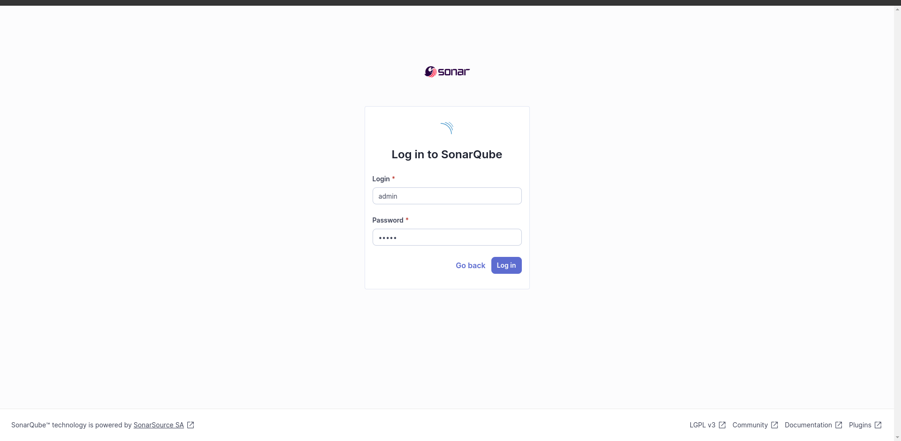
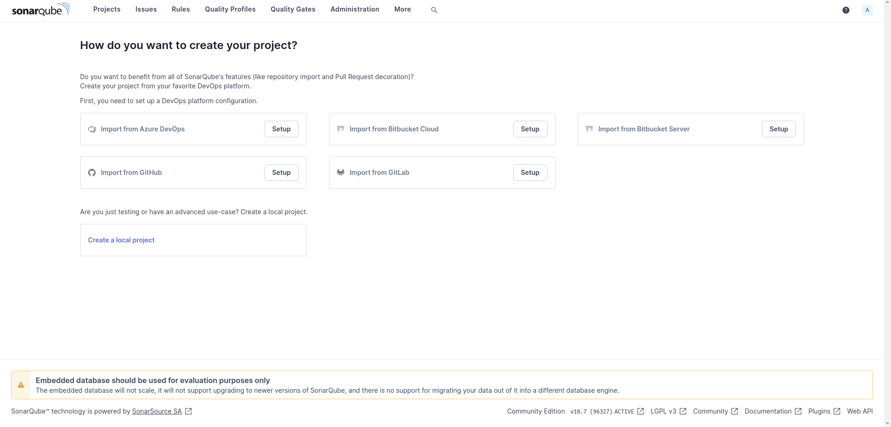
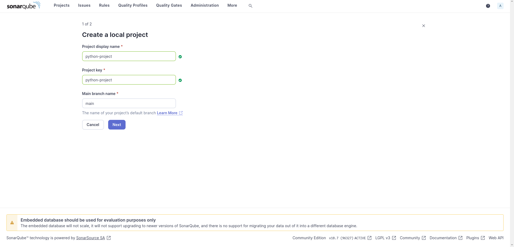
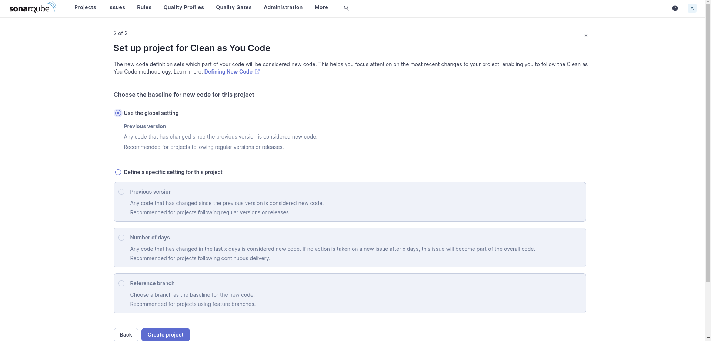
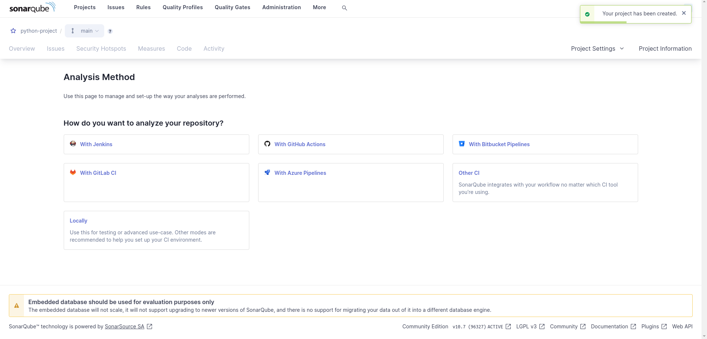
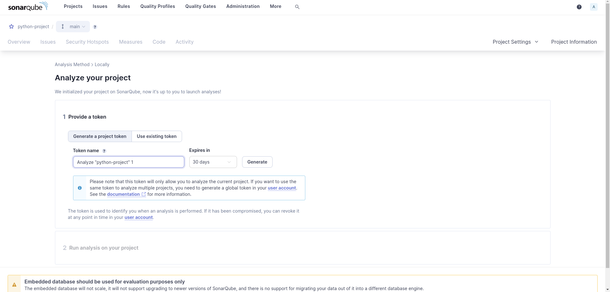
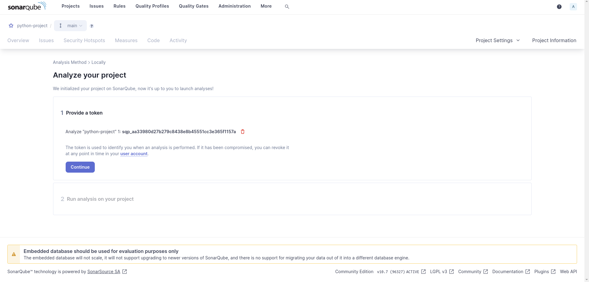
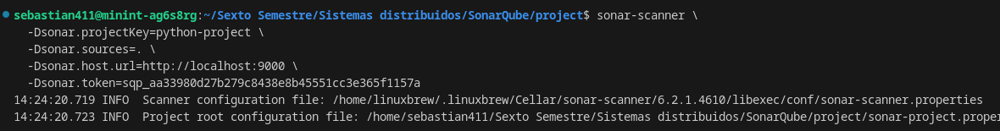
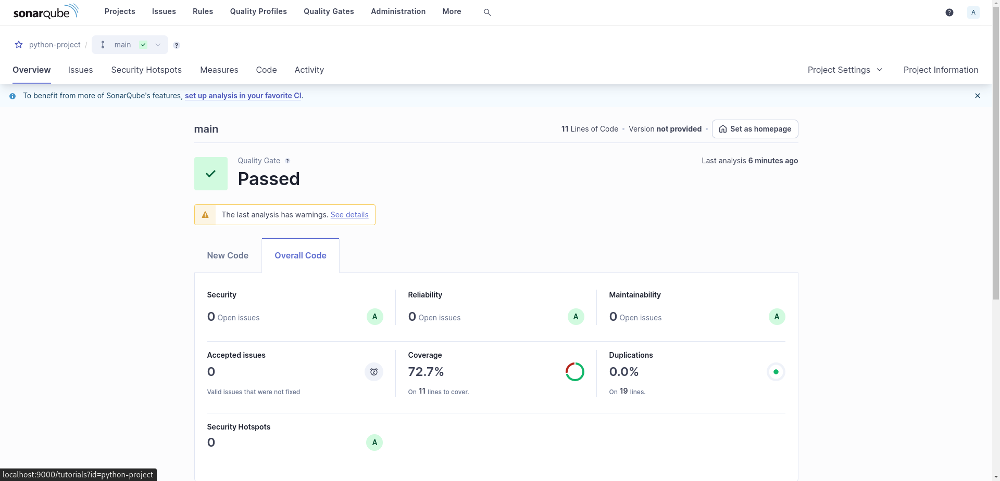

## 1️⃣ Configuración del Docker-Compose 📋

Para iniciar SonarQube y su base de datos, necesitamos crear un archivo `docker-compose.yml` con la siguiente configuración:

```yaml
version: "3.8"

services:
  sonarqube:
    image: sonarqube
    ports:
      - "9000:9000"
    networks:
      - sonarnet
    environment:
      - SONARQUBE_JDBC_URL=jdbc:postgresql://db:5432/sonar
      - SONARQUBE_JDBC_USERNAME=sonar
      - SONARQUBE_JDBC_PASSWORD=sonar
    volumes:
      - sonarqube_conf:/opt/sonarqube/conf
      - sonarqube_data:/opt/sonarqube/data
      - sonarqube_extensions:/opt/sonarqube/extensions
      - sonarqube_bundled-plugins:/opt/sonarqube/lib/bundled-plugins

  db:
    image: postgres
    networks:
      - sonarnet
    environment:
      - POSTGRES_USER=sonar
      - POSTGRES_PASSWORD=sonar
    volumes:
      - postgresql:/var/lib/postgresql
      - postgresql_data:/var/lib/postgresql/data

networks:
  sonarnet:
    driver: bridge

volumes:
  sonarqube_conf:
  sonarqube_data:
  sonarqube_extensions:
  sonarqube_bundled-plugins:
  postgresql:
  postgresql_data:
```

Esta configuración levanta dos servicios:
- **SonarQube**: expuesto en el puerto `9000`.
- **Postgres**: base de datos para SonarQube.

## 2️⃣ Iniciar los Servicios 🚀

Para levantar los servicios, ejecuta en la terminal el siguiente comando:

```bash
docker-compose up
```

Una vez ejecutado, accede a SonarQube en `http://localhost:9000`.

## 3️⃣ Acceder y Configurar SonarQube 🔐

1. Inicia sesión con las credenciales predeterminadas `admin` / `admin`.  
   

2. Cambia la contraseña cuando se te solicite para mejorar la seguridad.  
   

## 4️⃣ Creación de un Proyecto para Análisis de Código 🧩

Para analizar un proyecto local, sigue estos pasos:

1. Crea un nuevo proyecto en el dashboard de SonarQube.  
   

2. Configura los detalles básicos del proyecto.  
   

3. Completa la configuración de análisis.  
   

## 5️⃣ Generación de Token de Acceso 🔑

Para que SonarQube pueda autenticar el análisis, genera un **token de acceso** desde la configuración del proyecto:



Una vez generado, verás una pantalla como esta:  


## 6️⃣ Ejecutar el Análisis de Código 🖥️

Para ejecutar el análisis, utiliza el siguiente comando en el proyecto que deseas analizar (sustituyendo el token generado):

```bash
sonar-scanner \
  -Dsonar.projectKey=python-project \
  -Dsonar.sources=. \
  -Dsonar.host.url=http://localhost:9000 \
  -Dsonar.token=sqp_aa33980d27b279c8438e8b45551cc3e365f1157a
```



## 7️⃣ Ver Resultados en el Dashboard 📊

Al finalizar el análisis, accede al dashboard para revisar las métricas de calidad de tu proyecto. Aquí podrás ver el estado, la cobertura de pruebas y otros indicadores clave de la calidad del código:


